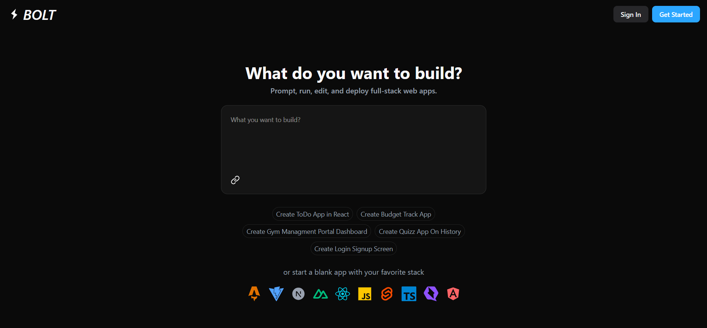

### BOLT.NEW CLONE
A powerful and elegant Blot.new] built using modern full-stack technologies. This project leverages Google Gemini for AI assistance, Sandpack for live Markdown preview, and integrates secure Google authentication.



## 🚀 Tech Stack

| Tech             | Description                                      |
|------------------|--------------------------------------------------|
| **ReactJS**       | Component-based UI                              |
| **NextJS**        | Full-stack framework with SSR & routing         |
| **NodeJS**        | Backend runtime for executing JavaScript        |
| **Tailwind CSS**  | Utility-first CSS for modern styling            |
| **ShadCN**        | Accessible components built on Radix UI         |
| **Convex**        | Real-time backend and database-as-a-service     |
| **Sandpack**      | Live code editor from CodeSandbox               |
| **Google OAuth**  | Authentication with your Google account         |
| **Google Gemini** | AI Studio / Gemini API for text generation      |
| **Git**           | Version control for team collaboration          |

## ✨ Features

- 🧠 **AI-assisted Markdown editing** with Google Gemini
- 📝 **Real-time Markdown preview** powered by Sandpack
- 🧾 **Blot.new-like UI/UX** for seamless writing experience
- 🔐 **Secure authentication** via Google OAuth
- 🧩 **Reusable and accessible components** via ShadCN
- ☁️ **Real-time data storage** using Convex
- 💡 **Modern, minimal, and responsive design**

## 📦 Getting Started

1. Clone the repository
```bash
git clone https://github.com/your-username/blot-clone.git
cd blot-clone
```
2. Install dependencies
```bash
npm install
```
3. Run the development server
```bash
npm run dev
```

### 📄 License
Distributed under the MIT License. See LICENSE for more information.
